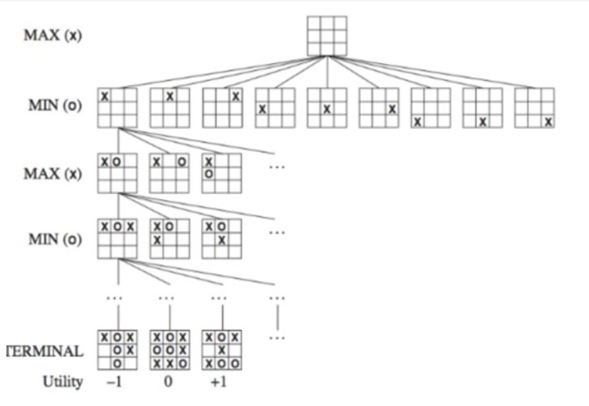
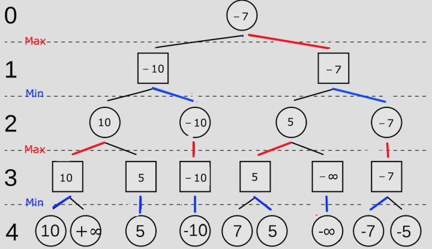

# 基于极大极小值算法和α-β剪枝的AI五子棋游戏
程镇-逻辑层开发
赵杰-UI设计
<!-- TOC -->

- [基于极大极小值算法和α-β剪枝的AI五子棋游戏](#基于极大极小值算法和α-β剪枝的ai五子棋游戏)
  - [游戏介绍](#游戏介绍)
    - [前言](#前言)
    - [功能](#功能)
    - [游戏特点](#游戏特点)
  - [设计架构与类图](#设计架构与类图)
  - [功能流程](#功能流程)
  - [核心算法](#核心算法)
    - [胜负判定](#胜负判定)
    - [局势评估](#局势评估)
    - [估值函数](#估值函数)
    - [攻防兼备](#攻防兼备)
    - [决策树](#决策树)
    - [极大极小值算法](#极大极小值算法)
    - [alpha-beta剪枝](#alpha-beta剪枝)
  - [测试](#测试)

<!-- /TOC -->
## 游戏介绍
### 前言
- 五子棋游戏是一款智力型的小游戏，公平益智，老少皆宜。其规则简介，玩法变化少，但是却蕴含着丰富又深刻的博弈知识。本着探求一个事物最深刻的内涵的理念，和对算法的喜爱，结合本学期所学习的AI算法知识以及Unity游戏开发知识，我制作了这款游戏，其中以极大极小值算法和α-β剪枝为核心，有三级人工智能。另外也有双人模式，可以好友娱乐对战。

### 功能
- AI对战
  - 初级  只对一部分棋形进行基本攻守
  - 中级  对全部的棋形进行基本攻守
  - 高级  在中级的基础之上，可以往后预测3步，选择最优解
- 双人模式
  - 好友对战
- 悔棋
  - 把每一步存在一个栈里，悔棋时退栈即可
- 交换先后手
  - 双方交换颜色，重新开始游戏

### 游戏特点
- 界面简单，交互友好，AI强大，老少皆宜。 

## 设计架构与类图
- 欢迎界面
  - 界面
  - 音效
- 人机模式
  - 更换先手
  - 悔棋
  - 返回
- 单人模式
  - 更换模式
  - 悔棋
  - 返回

  


## 功能流程
- 见运行测试说明

## 核心算法
### 胜负判定
  - 五子连珠，扫描棋盘八个方向，横、竖、斜、反斜四条线路，每个线路有两个方向，总共八个方向判定
  - 向量偏移法对15X15棋盘上每一个落子点的各个方向进行测试,(dx , dy) = {(1,0) ,(-1,0),(0,1),(0,-1),(1,1),(-1,-1),(1,-1),(-1,1) },大大减少代码量，增强代码复用性。

    ```c#
    //检查一条线 通过offset调整方向  横 竖 斜 反斜
    //以当前棋子位置pos为中心 正方向数当前player的棋子个数  负方向也数
    //当在这条线上当前player有连续5子 即胜利
    public bool CheckOneLine(int[] pos,int[] offset)
    {
        int linkNum = 1;//中心子算一个子
        //正方向 数子  注意边界
        for (int i = offset[0],j = offset[1];(pos[0] + i >= 0 && pos[0] + i <15) &&
            pos[1] + j >= 0 && pos[1] + j < 15; i += offset[0],j += offset[1])
        {
            if(grid[pos[0] + i, pos[1] + j] == (int)turn)
            {
                linkNum++;
            }
            else //遇到其他颜色的子即可退出
            {
                break;
            }
        }
        //负方向 数子
        for (int i = -offset[0], j = -offset[1]; (pos[0] + i >= 0 && pos[0] + i < 15) &&
            pos[1] + j >= 0 && pos[1] + j < 15; i -= offset[0], j -= offset[1])
        {
            if (grid[pos[0] + i, pos[1] + j] == (int)turn)
            {
                linkNum++;
            }
            else
            {
                break;
            }
        }

        //五子连珠即代表胜利
        if (linkNum > 4) return true;

        return false;
    }


    //判定
        //四个方向只要有一个5连珠成立即可判定胜负
    public bool CheckWinner(int [] pos)
    {
        if (CheckOneLine(pos, new int[2] { 1, 0 })) return true;
        if (CheckOneLine(pos, new int[2] { 0, 1 })) return true;
        if (CheckOneLine(pos, new int[2] { 1, 1 })) return true;
        if (CheckOneLine(pos, new int[2] { 1, -1})) return true;
        return false;
    }
    ```
    
### 局势评估
  - 分析各类棋形，对下述棋形进行从小到大的评分。遍历每一个未下棋的点，假设把子落在此处，计算落下该子形成的局部局势的分数。
    - 眠二  
    - 活二
    - 眠三
    - 活三
    - 冲四
    - 活四
    - 五子连珠
    ```c#
    Dictionary<string, float> toScore = new Dictionary<string, float>();
    protected override void Start()
    {
        //三级AI  将各种棋形进行扩充 
        toScore.Add("aa___", 100);                      //眠二
        toScore.Add("a_a__", 100);
        toScore.Add("___aa", 100);
        toScore.Add("__a_a", 100);
        toScore.Add("a__a_", 100);
        toScore.Add("_a__a", 100);
        toScore.Add("a___a", 100);

        toScore.Add("__aa__", 500);                     //活二 
        toScore.Add("_a_a_", 500);
        toScore.Add("_a__a_", 500);

        toScore.Add("_aa__", 500);
        toScore.Add("__aa_", 500);

        toScore.Add("a_a_a", 1000);
        toScore.Add("aa__a", 1000);
        toScore.Add("_aa_a", 1000);
        toScore.Add("a_aa_", 1000);
        toScore.Add("_a_aa", 1000);
        toScore.Add("aa_a_", 1000);
        toScore.Add("aaa__", 1000);                     //眠三
        toScore.Add("_aa_a_", 9000);                    //跳活三
        toScore.Add("_a_aa_", 9000);
        toScore.Add("_aaa_", 10000);                    //活三      
        toScore.Add("a_aaa", 15000);                    //冲四
        toScore.Add("aaa_a", 15000);                    //冲四
        toScore.Add("_aaaa", 15000);                    //冲四
        toScore.Add("aaaa_", 15000);                    //冲四
        toScore.Add("aa_aa", 15000);                    //冲四      
        toScore.Add("_aaaa_", 1000000);                 //活四

        toScore.Add("aaaaa", float.MaxValue);           //连五


        if (chessColor != ChessType.Watch)
            Debug.Log(chessColor + "AILevelThree");
    }
    ```

### 估值函数
- 对棋盘所有空白处的点进行分析，遍历该点的四个方向，对每一个方向取7个子进行局势分析，综合攻守两个因素，选取最好的落子方法。
```c#
public float CheckOneLine(int[,] grid, int[] pos, int[] offset, int chess)
    {
        float score = 0;
        bool lfirst = true, lstop = false, rstop = false;
        int AllNum = 1;
        string str = "a";
        int ri = offset[0], rj = offset[1];
        int li = -offset[0], lj = -offset[1];
        while (AllNum < 7 && (!lstop || !rstop))
        {
            if (lfirst)
            {
                //左边
                if ((pos[0] + li >= 0 && pos[0] + li < 15) &&
            pos[1] + lj >= 0 && pos[1] + lj < 15 && !lstop)
                {
                    if (grid[pos[0] + li, pos[1] + lj] == chess)
                    {
                        AllNum++;
                        str = "a" + str;

                    }
                    else if (grid[pos[0] + li, pos[1] + lj] == 0)
                    {
                        AllNum++;
                        str = "_" + str;
                        if (!rstop) lfirst = false;
                    }
                    else
                    {
                        lstop = true;
                        if (!rstop) lfirst = false;
                    }
                    li -= offset[0]; lj -= offset[1];
                }
                else
                {
                    lstop = true;
                    if (!rstop) lfirst = false;
                }
            }
            else
            {
                if ((pos[0] + ri >= 0 && pos[0] + ri < 15) &&
          pos[1] + rj >= 0 && pos[1] + rj < 15 && !lfirst && !rstop)
                {
                    if (grid[pos[0] + ri, pos[1] + rj] == chess)
                    {
                        AllNum++;
                        str += "a";

                    }
                    else if (grid[pos[0] + ri, pos[1] + rj] == 0)
                    {
                        AllNum++;
                        str += "_";
                        if (!lstop) lfirst = true;
                    }
                    else
                    {
                        rstop = true;
                        if (!lstop) lfirst = true;
                    }
                    ri += offset[0]; rj += offset[1];
                }
                else
                {
                    rstop = true;
                    if (!lstop) lfirst = true;
                }
            }
        }

        string cmpStr = "";
        foreach (var keyInfo in toScore)
        {
            if (str.Contains(keyInfo.Key))
            {
                if (cmpStr != "")
                {
                    if (toScore[keyInfo.Key] > toScore[cmpStr])
                    {
                        cmpStr = keyInfo.Key;
                    }
                }
                else
                {
                    cmpStr = keyInfo.Key;
                }
            }
        }

        if (cmpStr != "")
        {
            score += toScore[cmpStr];
        }
        return score;
    }
 
```
### 攻防兼备
- 对某空白处进行两种棋子落子后的局势进行分析，计算攻和守综合达到的效果。
```c#
   //综合各个因素考虑分数
      public float GetScore(int[,] grid, int[] pos)
    {
        float score = 0;
        //攻
        score += CheckOneLine(grid, pos, new int[2] { 1, 0 }, 1);
        score += CheckOneLine(grid, pos, new int[2] { 1, 1 }, 1);
        score += CheckOneLine(grid, pos, new int[2] { 1, -1 }, 1);
        score += CheckOneLine(grid, pos, new int[2] { 0, 1 }, 1);
        //守
        score += CheckOneLine(grid, pos, new int[2] { 1, 0 }, 2);
        score += CheckOneLine(grid, pos, new int[2] { 1, 1 }, 2);
        score += CheckOneLine(grid, pos, new int[2] { 1, -1 }, 2);
        score += CheckOneLine(grid, pos, new int[2] { 0, 1 }, 2);

        return score;
    }

```

### 决策树
- 对当前局势进行下一步决策时，往往考虑的不仅仅是这一步的收益，而是要考虑多步，比如，象棋大师对某一步进行决策时需要往后预测5-6步。在五子棋中也可以应用到与之相似的方法。以下是构建决策树的步骤：
  - 对一个当前局势，遍历所有可能的下棋点，把这些点所构成的局势作为新局势，继续递归地构建子树。
  - 遍历所有可能的下棋点但是可以只保留若干个结点作下次子树构建，本程序中只扩展4个结点，若算力足够，可以扩展更多。
  - 子树深度对应着预测步数，本程序中限定往后预测3步。若算力足够可以预测更多。


    

    ```c#
    //对某一局势 创建博弈树  限定深度（思考步数）  
    public void CreateTree(MiniMaxNode node, int[,] grid, int deep, bool mySelf)
    {
        //深度计数为0或者值已经为无穷大了 直接返回
        if (deep == 0 || node.value == float.MaxValue)
        {
            return;
        }
        //当前点
        grid[node.pos[0], node.pos[1]] = node.chess;
        //得到当前点的孩子
        node.child = GetList(grid, node.chess, !mySelf);
        //对于每一个孩子，递归建立子树
        foreach (var item in node.child)
        {
            CreateTree(item, (int[,])grid.Clone(), deep - 1, !mySelf);
        }
    }
    ```
    
###  极大极小值算法
- 构建完决策树后，可以发现相邻两层是敌我双方所需要决策地层。很显然，我方要选出分数最高的方案，而对方要尽可能选分数最低的方案以抑制我。因此，便有了极大极小值算法。
- 如上图所示，对博弈树进行极大极小值算法，从底层开始，在DFS回溯的时候，按照当前层是Max层还是Min层，对子节点进行挑选，一直上推，直到知道第一层(即当前局势)应该做什么决策。
- 实例说明,从底层逐步返回可推之首层应该选择-7所对应的局势。

  
    ```c#

    //返回节点 极大极小
    List<MiniMaxNode> GetList(int[,] grid, int chess, bool mySelf)
    {
        List<MiniMaxNode> nodeList = new List<MiniMaxNode>();
        MiniMaxNode node;
        for (int i = 0; i < 15; i++)
        {
            for (int j = 0; j < 15; j++)
            {
                int[] pos = new int[2] { i, j };
                if (grid[pos[0], pos[1]] != 0) continue;

                node = new MiniMaxNode();
                node.pos = pos;
                node.chess = chess;
                //敌我双方 一正一负
                if (mySelf)
                    node.value = GetScore(grid, pos);
                else
                    node.value = -GetScore(grid, pos);

                if (nodeList.Count < 4) //只扩展4个结点，这四个结点是所有结点中的最优局势  事实上是局部最优 如果算力允许 可扩展至5，6，7，更多
                {
                    nodeList.Add(node);
                }
                else
                {
                    foreach (var item in nodeList)
                    {
                        if (mySelf)//自己要使分数最大 极大点
                        {
                            if (node.value > item.value)
                            {
                                nodeList.Remove(item);
                                nodeList.Add(node);
                                break;
                            }
                        }
                        else//对手要使分数最小  极小点
                        {
                            if (node.value < item.value)
                            {
                                nodeList.Remove(item);
                                nodeList.Add(node);
                                break;
                            }
                        }
                    }
                }
            }
        }

        return nodeList;
    }
    ```

### alpha-beta剪枝
- 分析上一步所需要的时间复杂度，每一个结点经过O(n)时间扫描过后需要扩充4个结点，每一个结点重复以上过程，很显然，是一个指数级的搜索过程。


- 这样的搜索会使得AI下棋的速率非常之慢，因此必须要对搜索过程进行剪枝，由极大极小层的特性，下面介绍α-β剪枝。


- Alpha-beta修剪的名称来自计算过程中传递的两个边界，它根据已经看到的搜索树部分限制可能的解决方案集。特别，Beta是可能解决方案 的最小上限，Alpha是可能解决方案 的最大下限，因此，当任何新节点被视为解决方案的可能路径时，它只能在以下情况下工作：α<=N<=β,其中N是节点值的当前估计值。当发生α > β，则可以停止对该分支的搜索，即进行剪枝。

  

    ```c#
    //α-β剪枝
    public float AlphaBeta(MiniMaxNode node, int deep, bool mySelf, float alpha, float beta)
    {
        //如果当前结点是叶子结点（深度用完）或者已经是最大值或者最小值了 就可以直接返回

        if (deep == 0 || node.value == float.MaxValue || node.value == float.MinValue)
        {
            return node.value;
        }

        if (mySelf)
        {
            foreach (var child in node.child)
            {
                alpha = Mathf.Max(alpha, AlphaBeta(child, deep - 1, !mySelf, alpha, beta));

                //在Max层中 ， α >= β 发生alpha剪枝 返回α

                if (alpha >= beta)
                {
                    return alpha;
                }

            }
            return alpha;
        }
        else
        {
            foreach (var child in node.child)
            {
                beta = Mathf.Min(beta, AlphaBeta(child, deep - 1, !mySelf, alpha, beta));

                //在Min层中， α >= β 发生beta剪枝  返回beta
                if (alpha >= beta)
                {
                    return beta;
                }

            }
            return beta;
        }
    }

    ```
 
## 测试
- 见《运行测试说明》